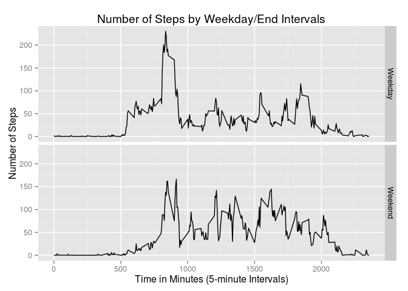

# Reproducible Research


### Loading and preprocessing the data 
Step 1 - load the data from the csv format, in a form such that each string is not a factor. 


```r
library(plyr)
rawData <- read.csv("activity.csv", stringsAsFactors = FALSE)
```

### What is mean total number of steps taken per day? 
Step 2 - Get the Total Number of Steps.  

For this, we need to exclude all entries that have an NA, then sum it for each day.
 
This can then be plotted as a histogram. 


```r
corrData <- rawData[!is.na(rawData$steps),]
dailySum <- ddply(corrData,.(date), summarise,sumOf=sum(steps))
hist(dailySum$sumOf, xlab = "Number of Steps", main = "Total Number of Steps per Day")
```

 


```r
meanVal <- mean(dailySum$sumOf)
medianVal <- median(dailySum$sumOf)
```

The mean value for the number of steps per day is 10766
  
The median value for the number of steps per day is 10765 

### What is the average daily activity pattern? 
Step 3 - The average daily activity pattern 
For this, we find the average number of steps in each time interval, which means we now look at the data interval-wise rather than datewise. 


```r
patternForDay <- ddply(corrData,.(interval), summarise, avgVal=mean(steps))
plot(x = corrData$interval[1:288], y = patternForDay$avgVal, type = 'l',
   xlim = c(0,2400), 
   main = "Average Number of Steps Interval-wise",
   xlab = "Time in Minutes (5-minute Intervals)",
   ylab = "Average Number of Steps")
```

 

It would be interesting to see which is the interval with the maximum average activity, and what is the value of that max Value! 


```r
maxVal <- max(patternForDay$avgVal)
maxInterval <- patternForDay[(patternForDay$avgVal == maxVal),]$interval
```

The maximum value of the average number of steps per interval is 206.1698, and it happens at the interval 835 

### Imputing missing values


```r
numMissVal <- sum(is.na(rawData$steps))
```

The total number of missing values is 2304   

There are several possible strategies for filling in missing values 

- The average from the 5 minute intervals

- The day's average 

- the overall average 

each has its advantages, as well as drawbacks.  

A safe choice is that interval's average (choice 1).  

On looking at the data, it was seen that 8 days had no data at all, so choice 2 would not have worked. 


```r
newData <- rawData 
for (i in 1:nrow(newData)) {
   if (is.na(newData$steps[i])) {
      theInterval = newData$interval[i]
      newData$steps[i] = patternForDay[patternForDay$interval==theInterval,]$avgVal       
   }
}
checkVals <- sum(is.na(newData$steps))
newDailySum <- ddply(newData,.(date), summarise,sumOf=sum(steps))
hist(newDailySum$sumOf, xlab = "Number of Steps", main = "Total Number of Steps per Day")
```

 

```r
newMeanVal <- mean(newDailySum$sumOf)
newMedianVal <- median(newDailySum$sumOf)
```

Old Mean and Median - 10766 and 10765  

New Mean and Median - 10766 and 10766 


```r
newData$day <- weekdays(as.Date(newData$date,"%Y-%m-%d"))
newData$endOrDay <- rep("Weekend",nrow(newData))
newData[newData$day %in% c("Monday","Tuesday","Wednesday","Thursday","Friday"),]$endOrDay <- "Weekday"
weekendNum <- nrow(newData$endOrDay == "Weekend")
plotData <- ddply(newData, .(endOrDay, interval), summarise, meanVal=mean(steps))
library(ggplot2)
pm <- ggplot(data=plotData, aes(x=interval, y=meanVal)) +
   facet_grid(endOrDay ~ . ) +
   geom_line(stat="identity") +
   ylab("Number of Steps") + 
   xlab('Time in Minutes (5-minute Intervals)') +
   ggtitle("Number of Steps by Weekday/End Intervals")
print(pm)
```

 
